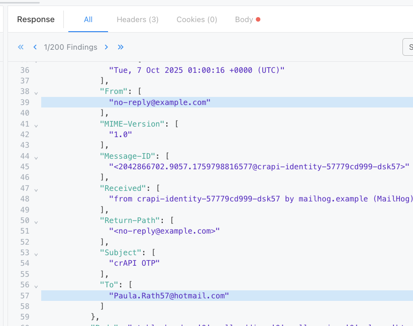

# Wstęp do Noname Advanced API Security for IBM

 

**Ostatnia aktualizacja:** Październik 2025

**Czas trwania:** 20 - 30 minut

## Dostęp do środowiska 

W tym laboratorium wykorzystamy środowisko DEMO dostępne pod linikiem: [TUTAJ]( https://wave-soft-stone.nnsworkshop.com)

Login: adres e-mail

Hasło: podadzą prowadzący podczas warsztatów.

## Wprowadzenie

Współczesne organizacje w coraz większym stopniu opierają swoją działalność na integracji systemów, automatyzacji procesów i wymianie danych w czasie rzeczywistym. Istotną rolę w tym obszarze odgrywają API (Application Programming Interface), czyli interfejsy programistyczne umożliwiające bezpieczną i standaryzowaną komunikację pomiędzy aplikacjami. Dzięki API firmy mogą szybciej reagować na zmiany rynkowe, wprowadzać innowacje, integrować rozwiązania chmurowe oraz udostępniać swoje usługi partnerom i klientom. W efekcie API staje się fundamentem nowoczesnych architektur IT, wspierając cyfrową transformację i budowę ekosystemów opartych na współpracy.

Choć wiele firm korzysta już z narzędzi obsługujących API, takich jak bramy API (API Gateways) czy zapory aplikacyjne (Web Application Firewalls), które zapewniają pewien poziom ochrony, powinny one być uzupełnione dedykowanymi rozwiązaniami bezpieczeństwa API. Takie rozwiązania są zaprojektowane specjalnie po to, by zapewniać pełną widoczność, ochronę w czasie rzeczywistym oraz ciągłe testowanie — niezbędne do obrony przed współczesnymi atakami na API.
I właśnie tutaj pomóc może Noname Advanced API Security for IBM.

## Wyzwanie

Zabezpieczenie interfejsów API stanowi ogromne wyzwanie. Organizacje często posiadają dziesiątki tysięcy API rozmieszczonych w różnych środowiskach, korzystających z różnych bram (gateways), zapór aplikacyjnych (WAF), load balancerów i innych komponentów. Utrudnia to zrozumienie, w jaki sposób API są kierowane, konfigurowane i wykorzystywane, co w praktyce uniemożliwia dokładną ocenę ryzyka, jakie stwarzają.

Sytuację dodatkowo komplikuje fakt, że nowe i istniejące API są szybko tworzone i wdrażane do środowisk produkcyjnych, co prowadzi do powstania dynamicznego i złożonego ekosystemu. Wszystkie te zagrożenia bezpieczeństwa są dziś łatwiejsze do wykorzystania niż kiedykolwiek wcześniej.

API zostały zaprojektowane tak, by były łatwe do tworzenia, zrozumienia i użycia — niestety, właśnie to sprawia, że są one tak podatne na ataki. Co więcej, większość podatności API dotyczy błędów w logice biznesowej, przez co trudno jest odróżnić „prawidłowe” od „złośliwego” zachowania API. W efekcie API stanowią bardzo rozległą i niezwykle atrakcyjną powierzchnię ataku.

## Przegląd rozwiązania Akamai API Security

Kompleksowe bezpieczeństwo API obejmuje cały cykl życia interfejsu API. Oznacza to ochronę w czterech kluczowych obszarach:

- Odkrywanie (Discovery)
- Zarządzanie postawą bezpieczeństwa (Posture Management)
- Ochrona w czasie działania (Runtime Protection)
- Aktywne testowanie (Active Testing) – ten element nie jest częścią tego laboratorium.

Zaczniemy od odkrywania i zarządzania postawą bezpieczeństwa, aby zrozumieć, jakie API mamy w środowisku Lab, co one robią, kto z nich korzysta, jakie dane są wymieniane, a także by zidentyfikować ewentualne błędne konfiguracje.

### Odkrywanie (Discovery) i Zarządzanie postawą bezpieczeństwa (Posture Management)

Te moduły pozwalają uzyskać pełną inwentaryzację interfejsów oraz naprawić podatności zanim zostaną wykorzystane.

Aby ograniczyć ryzyko związane z API organizacje muszą rozumieć, jakie dane API wysyła lub odbiera, kto jest jego właścicielem, kiedy były ostatnio aktualizowane, czy jest nadal używane oraz czy jest poprawnie skonfigurowane.

> Uwaga: Posture Management może również wspierać firmy w zakresie raportowania regulacyjnego. Na przykład, wiele organizacji musi raportować, jakie dane i API są wykorzystywane w ich środowisku.

### Ochrona w Czasie Działania (Runtime Protection)

Ten moduł koncentruje się na analizie transakcji API w czasie rzeczywistym lub z niewielkim opóźnieniem, tak aby nie zakłócać przepływu danych. Celem jest zbudowanie modelu bazowego zachowania API – czyli zrozumienia, co jest dla niego zachowaniem normalnym.
Gdy API zaczyna zachowywać się w sposób odbiegający od tej normy, system może wygenerować alert lub zgłosić incydent. 

>Warto zauważyć, że API Gateways i WAF-y chronią jedynie przed znanymi wzorcami ataków (np. na podstawie polityk lub dopasowań regex). Nie pomagają one jednak w przypadku błędów logicznych lub nieprawidłowej konfiguracji API.

### Aktywne Testowanie (Active Testing)

Ostatni moduł bezpieczeństwa API koncentruje się na testowaniu. Moduł testów w rozwiązaniu Akamai nosi nazwę Active Testing. To narzędzie pozwala testować API przed ich wdrożeniem do środowiska produkcyjnego lub przed publikacją nowej wersji. Celem jest automatyczne przeprowadzanie testów API w trakcie ich rozwoju, identyfikowanie i naprawianie błędów oraz zapobieganie wprowadzaniu podatności do środowiska produkcyjnego. Dzięki temu mamy pewność, że nowe wdrożenia nie wprowadzą dodatkowych zagrożeń dla bezpieczeństwa.

## Laboratorium

Przejdźmy teraz przez ćwiczenie laboratoryjne, aby zobaczyć, w jaki sposób Akamai API Security skutecznie identyfikuje i ogranicza ryzyka związane z bezpieczeństwem API.

### Panel Inwentaryzacji (Inventory Dashboard)

Zaczniemy od panelu przeglądowego inwentaryzacji API w rozwiązaniu Akamai API Security.
Panel ten prezentuje wszystkie interfejsy API w środowisku oraz rodzaje wrażliwych danych, z którymi te API mają kontakt. Dashboard jest dynamiczny – automatycznie wykrywa nowe API pojawiające się w ruchu sieciowym oraz rejestruje pełną historię zmian dotyczących istniejących API.

1. Zaloguj się do platformy, korzystając z podanego linku, loginu i hasła.

 

2. Kliknij zakładkę **Inventory**.

Jak widać, Akamai API Security wykonuje dużą pracy, gromadząc i kategoryzując cały ekosystem API na ekranie Statystyk (Stats).

Wykres Datatype Classification przedstawia podsumowanie liczby interfejsów API, które przetwarzają różne typy danych: *dane osobowe* (np. płeć, adres e-mail, numer identyfikacyjny pojazdu itp.), *dane płatnicze* (np. numery kart), *dane uwierzytelniające* (np. hasła), *dane zabronione* (np. niezaszyfrowane hasła), oraz *inne dane wrażliwe*.

Na tej stronie można również znaleźć inne przydatne informacje, takie jak typy API (API Type), sposoby uwierzytelniania (API Auth) oraz klasyfikacja API (API Classification).

3. Kliknij na zakładkę `APIs` w sekcji **Inventory**

Na początku widzisz ogólny spis API. Ten przegląd dostarcza szczegółowych informacji o każdym interfejsie API — takich jak host, ścieżka, metoda, informacja o tym, czy jest uwierzytelniony, czy jest dostępny publicznie (internet-facing) itp. Akamai API Security automatycznie rozpoznaje typ każdego API.

System klasyfikuje API jako unikalne połączenie Host + Metoda + Ścieżka, co pozwala dokładnie zidentyfikować każdy interfejs. Dodatkowo w tym widoku prezentowane są problemy i typy danych powiązane z poszczególnymi API.

Widok można filtrować, aby wyświetlać tylko określone typy API — dzięki temu łatwiej jest zrozumieć powierzchnię potencjalnych zagrożeń.
Na przykład: pokażmy tylko te API, dla których nie wykryto żadnego mechanizmu uwierzytelniania.

4. Aby to zrobić, przejdź do sekcji `Filters` po prawej stronie.
5. Znajdź filtr `Auth`.
6. Odznacz `(Select ALL)`.
7. Następnie zaznacz `Not Detected`.

Teraz widzimy, które z API nie mają żadnego rodzaju uwierzytelniania.
Przyjrzyjmy się teraz bliżej jednemu z nich, aby zobaczyć, jakie szczegółowe informacje możemy uzyskać z tych danych.

8. W pasku wyszukiwania wpisz: `/api/v2/search` lub wyszukaj z listy.

9. Kliknij na API, aby wyświetlić szczegóły.

Tutaj możemy zobaczyć najważniejsze informacje dt. API. Na pierwszy rzut oka widzimy liczbę problemów powiązanych z tym API, a także informację o tym, czy jest dostępne z Internetu (internet-facing), czy jest faktycznie używane przez Internet (internet-accessed) oraz przybliżoną liczbę użytkowników (consumers) korzystających z tego interfejsu.

Dzięki tym szczegółom można lepiej zrozumieć relacje między API a resztą infrastruktury, przepływy wywołań API (API call flows), zmiany w czasie oraz kto z API korzysta. Na podstawie tych danych można filtrować i grupować API według różnych kategorii, np. krytyczne API, wewnętrzne vs. zewnętrzne, według tagów lub właścicieli.

10. Kliknij na ikone `Samples`, aby zobaczyć przykładowe wywołanie i odpowiedź API.

Zobaczmy kolejną ciekawą funkcję, która automatycznie tworzy specyfikację OpenAPI dla interfejsu API.

11. Kliknij zakładkę `OpenAPI Spec`.

Po rozpoczęciu odbierania ruchu system buduje w czasie rzeczywistym „żyjącą” specyfikację API.

Jeśli posiadasz własne specyfikacje API, możesz załadować je do Akamai API Security — zarówno przez interfejs użytkownika (UI), jak i za pomocą Akamai API Security Management API. Dzięki temu narzędzie może porównać (wykonać diff) to, co powinno znajdować się w specyfikacji, z tym, co faktycznie obserwujemy w środowisku produkcyjnym.

Nawet jeśli nie mamy specyfikacji do przesłania, po zakończeniu fazy uczenia Akamai API Security automatycznie powiadamia o wszelkich zmianach w API lub odchyleniach od specyfikacji (spec drift).
Ta funkcja pozwala wykrywać sytuacje, w których np. deweloperzy wprowadzają zmiany w API, ale nie aktualizują dokumentacji.

Znajdźmy taki przypadek.

12. Wyczyść filtry klikając `Reset View` i wyczyść wyszukiwanie `Search APIs`.

13. Pogrupuj API po kolumnie `Spec Conformances`.

14. Rozwiń grupę `Diff|Sensitive`, a następnie kliknij `/community/api/v2/community/posts/recent`.
15. Wejdź na zakładkę `Conformance`.

Widzimy tam oznaczenie DIFF|SENSITIVE, które wskazuje, że specyfikacja tego interfejsu API nie została zachowana — odpowiedź zawierała pola, które nie były wymagane do prawidłowego działania tej usługi.

A skoro już mówimy o specyfikacjach API, pójdźmy o krok dalej — jak szybko określić, które z API zawierają w odpowiedziach dane wrażliwe, takie jak informacje PCI lub PII?

12. Kliknij na zakładkę `Datatypes` w sekcji **Inventory**.
13. Kliknij na typ `Card Number`.

14. Znajdź API ze ściezka: ` workshop/api/shop/orders/<number>` i kliknij w API.

Teraz możemy szybko sprawdzić, że spośród dziesiątek naszych interfejsów API jeden zwraca numer karty (Card Number) w treści odpowiedzi. Po otwarciu przykładowego wywołania API możemy przewinąć w dół i dokładnie zobaczyć, w którym miejscu odpowiedzi ten numer karty jest zwracany.

15. Otwórz przykład wywołania API klikając `Samples` i znajdź numer karty kredytowej. 

> Zwróć uwagę, że wybrane (skonfigurowane) dane wrażliwe są zaciemnione przez silnik analityczny, aby nie pokazywać danych wrażliwych.

Skoro już mowa o naruszeniach polityk bezpieczeństwa, przejdźmy teraz do ochrony w czasie rzeczywistym (Runtime Protection), aby zobaczyć, jak wyglądałyby takie naruszenia w praktyce — w sytuacji, gdy Akamai API Security wykryje rzeczywisty atak na  API.

### Ochrona w Czasie Działania (Runtime Protection)

1. Przejdź do strony `Overview` klikając zakładkę **Security**.

Strona Przeglądu (Overview) zawiera różne widżety, które podsumowują kwestie bezpieczeństwa w kilku ujęciach:

- Findings by Severity (Wyniki według poziomu zagrożenia)

Poziom istotności (Severity) danej podatności jest określany na podstawie kilku czynników, które razem wyznaczają ogólne ryzyko dla usługi API, wynikające z wykrytych problemów konfiguracyjnych (posture findings).
Kliknięcie w określony poziom zagrożenia pozwala wyświetlić filtrowaną listę wszystkich incydentów o tym poziomie.

- Attacker Groups (Grupy atakujących) (ostatnie 30 dni)

Sekcja Grupy atakujących pokazuje statusy, w jakich sklasyfikowano wykrytych atakujących:
Unidentified (niezidentyfikowani), Under Investigation (badani), Blocked (zablokowani) oraz Monitored (monitorowani).
Kliknięcie na dowolną grupę pozwala wyświetlić filtrowaną listę problemów związanych z tym typem atakującego.

- OWASP API Security Top 10 (2023)

Ta sekcja przedstawia liczbę problemów bezpieczeństwa, odwzorowaną względem rankingu OWASP API Security Top 10 2023.
Wyniki (Findings) i incydenty w czasie działania (Runtime Incidents) są celowo rozdzielone.
Kliknięcie dowolnej liczby w tabeli OWASP pozwala przefiltrować problemy według konkretnego typu podatności.

W tym laboratorium skupimy się na jednej z najczęściej występujących podatności z tej listy – #1: Broken Object Level Authorization (BOLA), czyli naruszenie autoryzacji na poziomie obiektu.

- Runtime Incidents (ostatnie 30 dni)

Wykres pokazuje liczbę incydentów wykrytych w czasie rzeczywistym w ciągu ostatnich 30 dni.
Najedź kursorem na linię wykresu, aby zobaczyć liczbę incydentów dla poszczególnych dat.
Pod wykresem znajduje się lista typów incydentów (Incident Types) – kliknięcie dowolnego z nich pozwala zobaczyć filtrowane szczegóły.

- Attackers (ostatnie 30 dni)

Ten wykres prezentuje liczbę zidentyfikowanych atakujących w ostatnich 30 dniach.
Najedź kursorem na linię wykresu, aby zobaczyć szczegółowe dane dla konkretnych dat.

- Posture Findings (Wyniki z analizy postawy bezpieczeństwa)

Wykres pokazuje liczbę wykrytych problemów konfiguracyjnych (posture findings) w odniesieniu do odkrytych API.
Najedź kursorem na linię wykresu, aby zobaczyć liczby dla poszczególnych dat.
Pod wykresem znajduje się lista typów wykrytych problemów — kliknięcie dowolnego typu pozwala wyświetlić filtrowaną listę wyników.

2. Kliknij na zakładkę `Findings` w sekcji **Security**.

Każde wykryte zagrożenie (Finding) posiada przypisany poziom ryzyka — critical (krytyczny), high (wysoki), medium (średni), low (niski) lub informational (informacyjny) — oraz moduł, w którym zostało wykryte (np. Posture, Recon).

Wykryte zagrożenia wynikają z błędnych konfiguracji w środowisku.
Dla każdego wpisu prezentowane są m.in.: czas wykrycia (Detection Time), typ zagrożenia, API (którego dotyczy zagrożenie), status, oznaczenia OWASP Top 10 API, oraz właściciel API (API Owner) i inne.

Po prawej stronie ekranu (pionowo) znajdują się filtry (Filters), które można zastosować do listy zagrożeń.
Obok dostępna jest sekcja Columns, gdzie można włączać lub wyłączać wyświetlanie kolumn, tworząc własne widoki dopasowane do potrzeb.
W górnej części panelu znajduje się również pole wyszukiwania i grupowanie podobnie jak w panelu Inventory, umożliwiające przeszukiwanie wszystkich pól jednocześnie.

3. Pogrupuj zagrożenia po `Severity`.
4. Rozwiń `Critical` i kliknij zagrożenia ze ścieżką `/api/v2/messages`, aby zobaczyć jego szczegóły.

Widok szczegółów zawiera czytelne informacje o tym: co się wydarzyło, dlaczego stanowi to problem oraz jakie kroki naprawcze należy podjąć.

5. Kliknije przycisk `Evidence`.

Evidence (Dowód) pozwala przejrzeć dowody analizy śledczej (forensic evidence) związane z danym przypadkiem.

Przejdźmy teraz do problemu numer jeden na liście OWASP dotyczącej bezpieczeństwa API — API z naruszoną autoryzacją na poziomie obiektów, znanego jako BOLA (Broken Object Level Authorization).

BOLA występuje wtedy, gdy użytkownik może uzyskać dostęp do zasobów, które nie należą do niego. Przykładowo, podczas zakupów online możesz wypełniać swój koszyk, ale jeśli zmienisz swój userID na inny, możesz zobaczyć koszyk innego użytkownika.

Akamai API Security potrafi wykrywać i ostrzegać o takich sytuacjach, wykorzystując uczenie maszynowe do tworzenia bazowej linii odniesienia dla liczby zasobów, do których użytkownicy uzyskują dostęp. Jeśli kilku użytkowników zacznie odbiegać od tego wzorca, system zgłosi to jako potencjalny atak typu BOLA.

6. Przejdź do zakładki `Runtime --> Incidents` w sekscji **Security**.
7. Pofiltruj pod kolumnie `OWASP` i parametrze **API1:2023**.

8. Kliknij na jeden z incydentów.

Szczegóły incydentu zawierają łatwe do zrozumienia informacje o tym, co się wydarzyło, dlaczego stanowi to problem oraz jakie kroki naprawcze należy podjąć.

9. Przejdź do zakładki `Attacker Information`, aby zobaczyć szczegółowe informacje na temat atakującego.
10. Kliknije przycisk `Evidence`.

Teraz możemy zobaczyć, kim był atakujący, kiedy zostały wykonane te żądania API oraz jakie były odpowiednie żądania i odpowiedzi.

11. Przewiń w dół do sekcji, w której widoczny jest JWT (Request), i kliknij kilka wierszy — zauważysz, że użytkownik pozostaje ten sam, ale zawartość odpowiedzi (response payload) się zmienia.

Jak widać na podstawie dostarczonych przez Akamai API Security dowodów, użytkownik jest ten sam, lecz szczegóły odpowiedzi różnią się — co wskazuje na atak typu BOLA.

A więc potwierdziliśmy, że to rzeczywisty atak. Co dalej?
Musimy teraz podjąć odpowiednie działania.

Teraz możemy zablokować tego atakującego — Akamai API Security umożliwia to, ponieważ może być zintegrowany z WAF-em. load balancerem lub API Gatewayem.

12. Zamknij zakładkę dowodów i kliknij `Block Attacker`.

13. Zobacz dostępne opcje, natomiast nie uruchamiaj akcji blokującej. Zakmknij okienko.

Jedną z zalet wykonywania tego działania bezpośrednio z poziomu Akamai API Security jest to, że rozwiązanie to jest niezależne od używanych narzędzi, dzięki czemu może blokować atakującego na wielu warstwach jednocześnie — w API Gatewayach i WAF-ach. Co ważne, wszystko to można zrobić w ramach jednej, spójnej platformy.

Po zablokowaniu atakującego warto również powiadomić właścicieli tego API. Można to zrobić z tego samego menu, wybierając opcję  *Action*.

14. Kliknij przycisk `Actions`.
15. Zobacz dostępne opcje, natomiast nie uruchamiaj akcji. Zakmknij okienko.

Powiadomienia mogą zostać wysłane poprzez Jirę, Slacka lub webhook, zawierając szczegóły dotyczące zdarzenia — zwłaszcza jeśli masz już zbudowaną własną aplikację do obsługi powiadomień bezpieczeństwa.

###  Konice Laboratorium. Dziękujemy!

